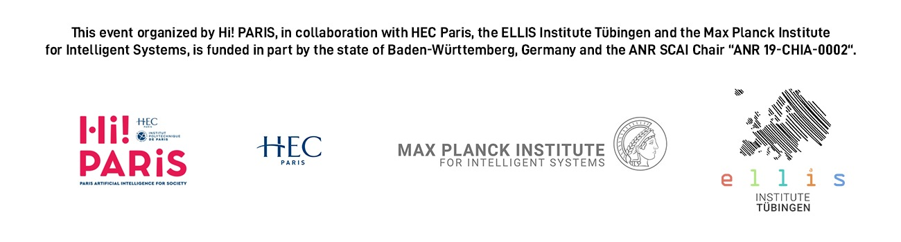

This year ICML is in Hawaii. You may not have been lucky enough to have enough funds to go, or you may simply have a few qualms about flying 20,000 km for a mere 4.2 tonnes of CO2. Nevertheless, you regret not being able to present your work, to find the atmosphere of a conference, with people working on subjects close to yours and with whom you could have productive discussions. Here's your chance to attend

2nd Ellis Unconference, on the HEC campus in Paris, Hawai in Paris, July 23-28 .

We'll be doing sessions with ICML papers and others. And every evening, we'll attend ICML tutorials together. The concept of the "unconference" diverges substantially from that of the conventional conference. This innovative paradigm involves assembling at a secluded campus to collaborate and exchange intellectual insights. We warmly extend invitations to everyone who has had their papers accepted at the International Conference on Machine Learning (ICML), and beyond this, our ambit is not limited.

Our program incorporates the organization of themed workshops that stimulate in-depth  exploration of particular areas of interest. Furthermore, we have arranged dedicated workspaces for individuals or small groups eager to delve profoundly into their chosen subjects.

As night falls, we will provide opportunities to connect live to ICML tutorials, thus, enhancing knowledge acquisition and exposure to experts in the field. Additionally, we intend to host insightful discussions, encouraging the participants to share their perspectives, debate on relevant issues, and contribute to the collective wisdom.

All this is free for Scholar / Fellow Ellis and Hi! members. Paris members. It's also free for two students chosen by Scholar / Fellow Ellis. For the others, you'll have to pay, but the costs are affordable, and cover everything from conference participation to lunches and dinners, and tutorial evenings! There'll be plenty of other stuff too, social event, sport, and the opportunities to meet with Ellis fellows ! Spread the announcement !

We invite you to book accommodation on site, as the idea is really to stay
together. The campus is very pleasant, with nice walks and easy access to sports
facilities.

## Program
Format and program:
### Sunday

### Monday

### Tuesday to Thursday:Thematic workshops will be organized to present the participants works and work that is presented at ICML.

Each workshop will be organized in 2 sessions, one in the morning 10:30-12:30, and one in the afternoon, 14:30-16:30.
Two types of talks will be considered:1. Your own work. 20 min talk on a recently published or submitted paper (IMCL23 or not)2. An ICML paper of your choice:  5 min lightning talk

<iframe src="https://calendar.google.com/calendar/embed?height=600&wkst=1&bgcolor=%23ffffff&ctz=Europe%2FParis&mode=WEEK&title=ELLIS%20Unconference%202023&showNav=1&hl=en&src=ZTA4ODZjZDcwMmQ0Njg5YzE0MDZmZDQxOWVjMjI3Yjg5MGM3M2U4NmQ0OTcyYzYxYTRiYTgzNTI3YjA0MDAyMkBncm91cC5jYWxlbmRhci5nb29nbGUuY29t&color=%239E69AF&dates=20230723/20230729" width="800" height="600" frameborder="0" scrolling="no"></iframe>

## Partners

